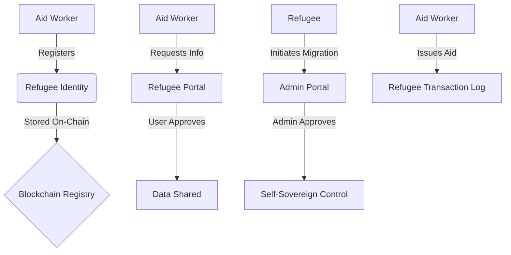

# RIMS: Refugee Identity Management System

RIMS is a high-fidelity, production-grade React.js v18 user interface designed for humanitarian aid operations. It provides a blockchain-powered framework for secure, self-sovereign identity management and translucent aid distribution.

## 🏗 System Blueprint & Architecture

### Tech Stack
- **State Management**: React Context API
- **Wallet Connection**: @perawallet/connect (Real Pera Wallet Integration)
- **Backend Connectivity**: REST API integration via `VITE_API_BASE_URL` (Ngrok supported)
- **Biometrics**: react-webcam for live onboarding
- **Scanning**: @yudiel/react-qr-scanner for real-time verification
- **QR Generation**: qrcode.react for dynamic identity cards
- **Styling**: Vanilla CSS with TailwindCSS Utilities (Dark Navy base, Electric Teal/Amber accents).
- **Icons**: Lucide React for consistent, serious iconography.
- **Routing**: React Router v6 for role-based navigation.
- **State**: React Context for global UI indicators (Toast notifications).
- **Data**: Centralized mock data system (`mockData.js`) that simulates blockchain state transitions.

### Core Philosophy: Self-Sovereign Identity (SSI)
RIMS is built on the principle that refugees should own their identity. The system facilitates the transition from custodial (NGO-managed) identities to fully self-sovereign (Refugee-managed) identities.

---

## 🧭 Multi-Portal Ecosystem

The system consists of three interconnected portals, each serving a specific stakeholder in the humanitarian lifecycle:

### 1. Refugee Portal (`/refugee`)
- **Dashboard**: View personal identity status and recent activity.
- **Access Requests**: Approve or reject requests from Aid Workers to view specific identity attributes (Selective Disclosure).
- **Wallet Migration**: Upgrade from a custodial identity to a personal Pera wallet via a multi-step on-chain migration process.

### 2. Aid Worker Portal (`/aid-worker`)
- **Register Refugee**: Onboard new individuals with multi-step validation.
- **QR Code Issuance**: Replaced static patterns with dynamic JSON-encoded QR codes using `qrcode.react` for identity verification.
- **Registered Refugees**: A searchable identity registry with detailed profile side-drawers.
- **Scan QR**: High-speed identity verification in the field.
- **Search & Filter**: Comprehensive registry lookup.
- **Request Access**: Request specific data (e.g., Age, Nationality) from a refugee's wallet.
- **Aid Distribution**: Log and verify the issuance of resources (Food, Medicine, Cash).

### 3. Admin Portal (`/admin`)
- **Overview**: System-wide analytics and trend monitoring.
- **Migration Approvals**: High-level governance role to approve identity transfers to personal devices.
- **Audit Log**: A immutable master record of all on-chain events (Registrations, Consents, Migrations).
- **System Health**: Monitoring the Algorand network, Smart Contract status, and API availability.

---

## 🔄 Lifecycle Workflow

---

## ✅ Implementation Progress (V2.0 Connected)
1. **Full-Stack Connectivity**: Replaced most mock systems with real `fetch()` calls to a live backend.
2. **Dynamic Hardware**: Fully operational webcam liveness and camera-based QR scanning.
3. **Pera Wallet Integration**: Real-time signing and session management active.
4. **Persistent Governance**: Access requests and migrations are now recorded in a central database.
5. **Universal UX**: All three portals updated to handle loading states and network errors.

---

## 🚀 Next Steps (AI Implementation Guide)

If you are an AI taking over this project, focus on these critical integration steps:

### Phase 1: Institution Complete
- **Backend Linkage**: Connected Registration, Scanning, and Aid logic to Node.js/MongoDB.
- **Environment Driven**: System now scales via `.env` configuration.
- **Persistent Audit**: Events are now saved to a persistent database (Audit Log).

### Phase 2: Implementation Complete
- **Wallet Connection**: Implemented `@perawallet/connect` - Live signing ready.
- **Live Biometrics**: Implemented `react-webcam` - Real-time liveness UI active.
- **QR Scanning/Generation**: Implemented `Scanner` and `QRCodeSVG` - Fully operational.

### Key Features
- **Universal Portals**: Seamless transition between Admin, Aid Worker, and Refugee views.
- **Pera Wallet Connect**: Real-time connection to Pera Wallet for refugees and workers.
- **Live Biometric UI**: Real-time webcam integration for liveness checks during onboarding.
- **Hardware QR Scanner**: Integrated camera-based QR scanning for field workers.
- **Dynamic Identity QR**: Real-time generation of security cards for refugees.
- **Identity Lifecycle**: Registration, QR issuance, and sovereign migration wizards.

### Phase 3: Backend Persistence
- **State Sync**: Build a Node.js/Express indexing service to cache the blockchain state for faster searching in the Admin/Aid Worker portals.
- **Identity Revocation**: Implement the logic for marking identities as inactive on-chain.
